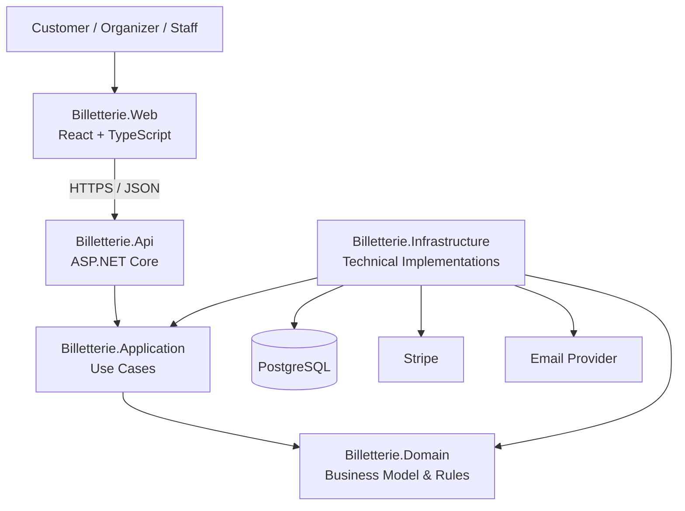

# Architecture Overview

## 1. Purpose

Billetterie is an event ticketing platform designed to allow users to discover events, reserve seats, complete payments and receive digital tickets.

The platform also allows event organizers to create and manage events, venues, seating configurations and ticket availability.

The initial goal of the project is to build a production-oriented MVP while keeping the architecture simple enough to evolve progressively.

---

## 2. Main Goals

The system must support the following main workflows.

### Visitors

- Browse available events.
- View event details.
- View venue and seat availability.
- Create an account.

### Customers

- Authenticate.
- Select a seat.
- Temporarily reserve a seat.
- Complete payment.
- Receive a digital ticket.
- View previously purchased tickets.

### Organizers

- Create and update events.
- Configure event information.
- Configure venue and seating information.
- Publish or unpublish events.
- View basic ticket sales information.

### Staff

- Validate a ticket at the entrance of an event.
- Detect already-used or invalid tickets.

---

## 3. Architectural Style

Billetterie will initially use a **modular monolith**.

The application will be deployed as a single backend system while maintaining clear separation between business responsibilities.

A modular monolith was chosen for the MVP because it provides:

- simpler development;
- simpler deployment;
- simpler debugging;
- transactional consistency;
- fewer operational concerns than microservices;
- the ability to separate the application into independent business modules.

The architecture should allow some modules to be extracted into independent services in the future if there is a justified need.

Microservices will not be introduced only for architectural complexity or portfolio purposes.

---

## 4. Repository Structure

```text
Billetterie/
├── src/
│   ├── Billetterie.Web/
│   ├── Billetterie.Api/
│   ├── Billetterie.Application/
│   ├── Billetterie.Domain/
│   └── Billetterie.Infrastructure/
│
├── tests/
│   ├── Billetterie.UnitTests/
│   └── Billetterie.IntegrationTests/
│
├── docs/
│   ├── architecture/
│   │   └── overview.md
│   └── adr/
│
├── docker-compose.yml
├── README.md
└── Billetterie.sln
````

---

## 5. Application Layers

### 5.1 Billetterie.Web

`Billetterie.Web` contains the frontend application.

Initial technologies:

* React;
* TypeScript;
* Vite.

Responsibilities:

* rendering the user interface;
* collecting user input;
* calling backend APIs;
* displaying application state;
* client-side navigation;
* displaying validation and error messages.

The frontend must not be responsible for authoritative business rules.

For example, the frontend may disable a reservation button when a seat appears unavailable, but the backend must still verify that the seat can actually be reserved.

---

### 5.2 Billetterie.Api

`Billetterie.Api` is the HTTP entry point of the backend.

Responsibilities:

* exposing REST endpoints;
* receiving HTTP requests;
* authentication;
* authorization;
* request validation;
* middleware;
* mapping requests to application use cases;
* returning appropriate HTTP responses.

The API should contain as little business logic as possible.

Example:

```text
POST /api/reservations
        ↓
Billetterie.Api
        ↓
ReserveSeat
        ↓
Billetterie.Application
```

---

### 5.3 Billetterie.Application

`Billetterie.Application` contains the use cases supported by the system.

Examples:

* CreateEvent;
* PublishEvent;
* GetEvents;
* GetEventDetails;
* ReserveSeat;
* CancelReservation;
* ConfirmPayment;
* GetCustomerTickets;
* ValidateTicket.

The Application layer coordinates the workflow necessary to complete a use case.

Example:

```text
ReserveSeat
    ↓
Retrieve required data
    ↓
Apply business rules
    ↓
Create reservation
    ↓
Persist changes
```

The Application layer may depend on `Billetterie.Domain`.

It must not depend directly on concrete infrastructure implementations such as PostgreSQL, Entity Framework Core or Stripe.

When external functionality is required, the Application layer communicates through abstractions.

Example:

```text
Billetterie.Application
        ↓
IReservationRepository
```

---

### 5.4 Billetterie.Domain

`Billetterie.Domain` contains the core business concepts and business rules of the application.

It must remain independent from infrastructure technologies.

The Domain must not depend directly on:

* PostgreSQL;
* Entity Framework Core;
* Stripe;
* Redis;
* RabbitMQ;
* HTTP;
* ASP.NET Core;
* React;
* external APIs.

Possible business concepts include:

* Event;
* Venue;
* Section;
* Seat;
* Reservation;
* Order;
* Payment;
* Ticket.

The Domain is responsible for protecting business consistency.

Example:

> An expired reservation cannot be confirmed.

The Domain should enforce this rule regardless of whether the operation originates from an HTTP request, background process or another interface.

---

### 5.5 Billetterie.Infrastructure

`Billetterie.Infrastructure` contains technical implementations and integrations with external systems.

Possible responsibilities:

* Entity Framework Core;
* PostgreSQL persistence;
* Stripe integration;
* email delivery;
* file storage;
* Redis;
* RabbitMQ;
* external services.

Example:

```text
Billetterie.Application
        ↓
IReservationRepository

Billetterie.Infrastructure
        ↓
PostgresReservationRepository
```

Infrastructure implements abstractions required by the Application layer.

---

## 6. Dependency Direction

The main dependency direction is:

```text
Billetterie.Web
       |
       | HTTPS / JSON
       v
Billetterie.Api
       |
       v
Billetterie.Application
       |
       v
Billetterie.Domain
```

Infrastructure provides implementations required by Application and Domain:

```text
Billetterie.Infrastructure
        |
        +------> Billetterie.Application
        |
        +------> Billetterie.Domain
```

At runtime, `Billetterie.Api` is responsible for composing the application and infrastructure implementations.

---

## 7. Business Modules

The application is divided into business modules.

A business module represents a coherent functional area of the system.

A module may contain several entities, value objects, business rules and use cases.

### Identity

Responsibilities:

* users;
* authentication;
* authorization;
* roles;
* customer identity;
* organizer identity.

Possible concepts:

```text
User
Role
```

### Events

Responsibilities:

* event creation;
* event modification;
* publication;
* event information;
* event scheduling.

Possible concepts:

```text
Event
EventStatus
```

### Venues

Responsibilities:

* venues;
* sections;
* rows;
* seats;
* seating configuration.

Possible concepts:

```text
Venue
Section
Row
Seat
```

### Reservations

Responsibilities:

* temporary seat reservations;
* reservation status;
* reservation expiration;
* reservation cancellation;
* prevention of invalid reservations.

Possible concepts:

```text
Reservation
ReservationItem
ReservationStatus
```

### Orders

Responsibilities:

* finalized customer purchases;
* order totals;
* association between payment and purchased tickets.

Possible concepts:

```text
Order
OrderItem
OrderStatus
```

### Payments

Responsibilities:

* payment creation;
* payment status;
* payment confirmation;
* payment provider integration.

Possible concepts:

```text
Payment
PaymentStatus
```

Stripe-specific code must remain outside the Domain layer.

### Tickets

Responsibilities:

* ticket issuance;
* ticket ownership;
* QR or token generation;
* ticket validation;
* prevention of duplicate entry.

Possible concepts:

```text
Ticket
TicketStatus
```

### Notifications

Responsibilities:

* purchase confirmation;
* ticket delivery;
* reservation-related notifications.

The delivery mechanism itself belongs to Infrastructure.

---

## 8. Domain Organization

The Domain may initially be organized by business module.

```text
Billetterie.Domain/
├── Identity/
├── Events/
│   ├── Event.cs
│   └── EventStatus.cs
├── Venues/
│   ├── Venue.cs
│   ├── Section.cs
│   ├── Row.cs
│   └── Seat.cs
├── Reservations/
│   ├── Reservation.cs
│   ├── ReservationItem.cs
│   └── ReservationStatus.cs
├── Orders/
├── Payments/
└── Tickets/
```

This structure may evolve as the domain becomes better understood.

Folders should represent actual business concepts and not exist only to satisfy an architectural pattern.

---

## 9. Core Business Invariants

### INV-001 — Seat reservation uniqueness

A seat must not be successfully reserved by more than one active reservation for the same event.

### INV-002 — Reservation expiration

An expired reservation cannot be completed or converted into a successful purchase.

### INV-003 — Seat release

When a reservation expires or is cancelled, its seats must eventually become available again unless they have already been sold.

### INV-004 — Payment confirmation

A reservation must not be considered purchased before payment has been successfully confirmed.

### INV-005 — Ticket issuance

A ticket can only be issued after the corresponding purchase has been successfully confirmed.

### INV-006 — Ticket uniqueness

A successful purchase must not unintentionally generate duplicate tickets.

### INV-007 — Ticket validation

A ticket that has already been successfully validated at an event entrance cannot be successfully validated a second time.

### INV-008 — Published events

Customers may only purchase tickets for events that are currently available for sale.

---

## 10. Data Ownership and Source of Truth

PostgreSQL will be the primary persistent datastore for the MVP.

It will act as the authoritative source of truth for:

* events;
* venues;
* seats;
* reservations;
* orders;
* payment state recorded by Billetterie;
* tickets.

Additional technologies may later be introduced for performance or asynchronous processing.

Examples:

```text
Redis
RabbitMQ
```

These technologies must not be introduced without a clearly identified problem they are intended to solve.

---

## 11. Initial Technology Stack

### Frontend

```text
React
TypeScript
Vite
```

### Backend

```text
C#
ASP.NET Core
```

### Persistence

```text
PostgreSQL
Entity Framework Core
```

### Payments

```text
Stripe
```

Additional technologies may be introduced later when justified by specific requirements.

---

## 12. External Systems

Initial external integrations may include:

```text
Stripe
Email provider
```

Future integrations may include:

```text
Redis
RabbitMQ
Azure Blob Storage
Observability services
```

External systems must be accessed through `Billetterie.Infrastructure`.

---

## 13. API Communication

The initial frontend/backend communication model will use HTTP APIs and JSON.

Example:

```text
Billetterie.Web
        |
        | POST /api/reservations
        v
Billetterie.Api
        |
        v
Billetterie.Application
```

Real-time communication such as SignalR may be introduced later if the seat availability experience requires it.

---

## 14. Persistence Principles

The persistence layer should protect important business constraints whenever possible.

Possible mechanisms include:

* primary keys;
* foreign keys;
* unique constraints;
* transactions;
* indexes.

Critical business guarantees must not depend exclusively on frontend validation.

Concurrency-sensitive behavior such as seat reservation will be researched and documented separately before implementation.

---

## 15. Authentication and Authorization

Authentication and authorization will be handled by the backend.

Expected initial roles:

```text
Customer
Organizer
Staff
Administrator
```

### Customer

Possible permissions:

* reserve seats;
* purchase tickets;
* view owned tickets.

### Organizer

Possible permissions:

* create events;
* manage owned events;
* view event sales.

### Staff

Possible permissions:

* validate tickets.

### Administrator

Possible permissions:

* perform administrative operations.

The exact identity implementation will be selected later.

---

## 16. Testing Strategy

### Unit Tests

Location:

```text
tests/Billetterie.UnitTests/
```

Purpose:

* test isolated business logic;
* test domain rules;
* test application behavior where appropriate.

Example:

```text
ExpiredReservation_CannotBeConfirmed
```

### Integration Tests

Location:

```text
tests/Billetterie.IntegrationTests/
```

Purpose:

* test interactions with infrastructure;
* test persistence;
* test database constraints;
* test transactional behavior;
* test critical workflows.

Examples:

```text
ReserveSeat_WhenAvailable_Succeeds
ReserveSeat_WhenAlreadyReserved_Fails
```

Frontend and end-to-end testing strategies may be introduced later.

---

## 17. Architecture Decision Records

Significant architectural decisions will be documented using ADRs.

Location:

```text
docs/adr/
```

Initial expected ADRs:

```text
0001-use-modular-monolith.md
0002-use-postgresql.md
0003-postgresql-as-source-of-truth.md
```

Future ADRs may include:

```text
0004-seat-reservation-concurrency-strategy.md
0005-payment-processing-strategy.md
0006-use-redis.md
0007-use-message-broker.md
```

An ADR should be created when a decision:

* significantly affects the architecture;
* has meaningful alternatives;
* introduces an important trade-off;
* would be difficult to understand later without context.

---

## 18. Engineering Principles

### Prefer simplicity

Do not introduce distributed systems, microservices or additional infrastructure unless a concrete requirement justifies them.

### Business rules belong on the server

The frontend may improve user experience but cannot be trusted to enforce business rules.

### Domain rules should remain infrastructure-independent

Core business behavior should not require knowledge of PostgreSQL, Stripe or HTTP.

### Important workflows should be testable

Critical business flows should have automated tests.

### Architecture may evolve

This document represents the current architecture and may change as requirements become better understood.

### Decisions should have reasons

Technologies and patterns should be selected because they solve identified problems, not because they are fashionable or impressive.

---

## 19. Initial System Diagram



---

## 20. Planned Evolution

The MVP will initially favor the simplest architecture capable of correctly supporting the core ticket purchasing workflow.

Initial architecture:

```text
React + TypeScript
        ↓
ASP.NET Core
        ↓
Application
        ↓
Domain
        ↓
PostgreSQL
```

Additional components may be introduced later when justified by concrete requirements.

Possible examples:

```text
Redis
→ caching
→ temporary reservation support

SignalR
→ real-time seat availability

RabbitMQ
→ asynchronous processing

OpenTelemetry
→ tracing and observability

Azure
→ production hosting
```

Each significant introduction should be documented and justified.

---

## 21. Current Architecture Status

The architecture is currently in its initial design phase.

The following decisions are considered initial:

* React + TypeScript frontend;
* ASP.NET Core backend;
* modular monolith;
* PostgreSQL primary datastore;
* separation between Domain, Application, Infrastructure and API.

The following decisions remain intentionally open:

* exact authentication implementation;
* seat reservation concurrency strategy;
* reservation expiration mechanism;
* caching strategy;
* messaging architecture;
* real-time communication;
* cloud deployment architecture;
* payment workflow details.

These decisions will be made progressively as the corresponding features are designed.

```
```
